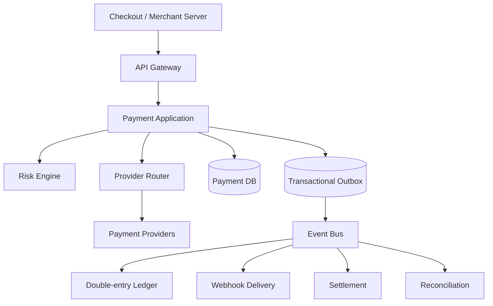
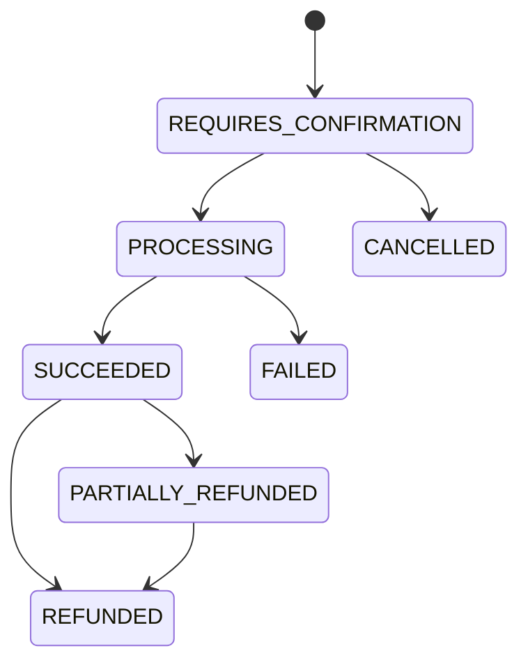

# Payment Platform V2

这是一个面向商户的支付平台工程。仓库根目录中原有的 `src/` 是早期微信支付 V2 接入代码，仅作为历史参考；新的实现位于 [payment-platform](./payment-platform)。

> 当前阶段使用 Mock Provider，不会发起真实扣款，也不要配置真实商户密钥。

## 目标

平台最终覆盖：

- Payment Intent：创建、确认、查询、取消
- 多支付渠道：Mock、微信支付 API v3，后续可扩展支付宝等
- 全额及部分退款
- 商户、客户和支付方式
- 双式账本、余额与结算
- Webhook 投递、签名和重试
- 对账、差异处理和审计
- 风控、限额和可观测性
- 商户管理后台与演示收银台

## 系统架构



第一阶段采用模块化单体。支付、账本、结算和 Webhook 在代码中保持领域边界，待吞吐量和团队规模确有需要时再独立部署。

## 核心设计原则

1. **金额使用最小货币单位**：例如人民币分，禁止使用浮点数。
2. **所有资金写操作支持幂等键**：相同键和相同请求返回首次结果；相同键但不同参数返回冲突。
3. **状态通过状态机转换**：禁止业务代码任意覆盖支付状态。
4. **渠道超时不等于失败**：结果未知时进入 `PROCESSING`，等待回调、主动查询或对账收敛。
5. **业务记录与账本分离**：Payment 描述业务状态，Ledger 是余额和资金流向的唯一事实来源。
6. **跨服务采用 Outbox**：数据库事务内同时写业务记录和事件，再异步投递。
7. **消费者必须幂等**：系统按至少一次投递设计，不假设全链路 exactly-once。
8. **账本只追加**：历史分录不修改，错误通过反向分录修正。
9. **敏感数据不进入日志**：真实卡号、CVV、API Secret 和私钥不得保存到普通数据库或日志。

## 支付状态机



所有转换通过领域对象完成，并结合数据库条件更新或版本号处理并发。

## 模块规划

```text
payment-platform/
├── api/                 HTTP API 与 DTO
├── application/         用例编排、事务边界、幂等
├── domain/              Payment、Refund、Ledger 等领域模型
├── infrastructure/      数据库、Outbox、配置和可观测性
└── provider/            支付渠道适配器
```

当前提交先在一个 Maven 模块中建立这些 package。领域稳定后再拆为多个构建模块，避免过早增加工程复杂度。

## API 草案

| Method | Path | 说明 |
|---|---|---|
| POST | `/v1/payment-intents` | 创建支付意图，要求 `Idempotency-Key` |
| POST | `/v1/payment-intents/{id}/confirm` | 使用 Mock Provider 确认支付 |
| GET | `/v1/payment-intents/{id}` | 查询支付状态 |

示例：

```bash
curl -X POST http://localhost:8080/v1/payment-intents \
  -H 'Content-Type: application/json' \
  -H 'Idempotency-Key: demo-order-001' \
  -d '{"merchantOrderId":"ORDER-001","amount":129900,"currency":"CNY"}'
```

## 本地启动

要求 Java 21 和 Maven 3.9+：

```bash
cd payment-platform
mvn test
mvn spring-boot:run
```

Mock Provider 规则：

- 普通金额：支付成功
- 金额尾数为 `02`：支付失败
- 金额尾数为 `77`：保持处理中

## 数据模型

首期核心表：

- `payment_intent`
- `payment_attempt`
- `refund`
- `outbox_event`
- `consumer_inbox`

后续账务表：

- `ledger_account`
- `ledger_transaction`
- `ledger_entry`
- `settlement`

关键唯一约束：

- `(merchant_id, merchant_order_id)`
- `(merchant_id, operation, idempotency_key)`
- `(provider, provider_reference)`
- `(consumer_name, event_id)`

## 建设路线

### Phase 1 — 可运行的模拟支付

- [x] 新工程和架构文档
- [x] Payment Intent 基础状态机
- [x] Mock Provider
- [x] 创建、确认和查询 API
- [ ] PostgreSQL 持久化
- [ ] Flyway Migration
- [ ] 数据库幂等记录
- [ ] 集成测试

### Phase 2 — 可靠性基础

- [ ] Transactional Outbox
- [ ] 异步任务和重试
- [ ] Webhook 签名及投递
- [ ] Refund 状态机
- [ ] 指标、Tracing 和审计日志

### Phase 3 — 资金系统

- [ ] 双式账本
- [ ] 商户余额
- [ ] 结算批次与 Payout
- [ ] 渠道及银行对账

### Phase 4 — 真实渠道

- [ ] 微信支付 API v3
- [ ] 平台证书和密钥托管
- [ ] 支付回调验签
- [ ] 沙箱及联调环境
- [ ] 风控与限额

## Legacy 代码说明

旧 `src/` 包含微信支付 V2、MyBatis、Druid 和部分工具类，但存在未完成方法、包名残留、缺失 Mapper 及过期依赖。新实现不会直接依赖它。

旧配置曾包含明文数据库凭证。任何曾经使用过的同类密码都应轮换；新的配置必须通过环境变量或 Secret Manager 注入。
